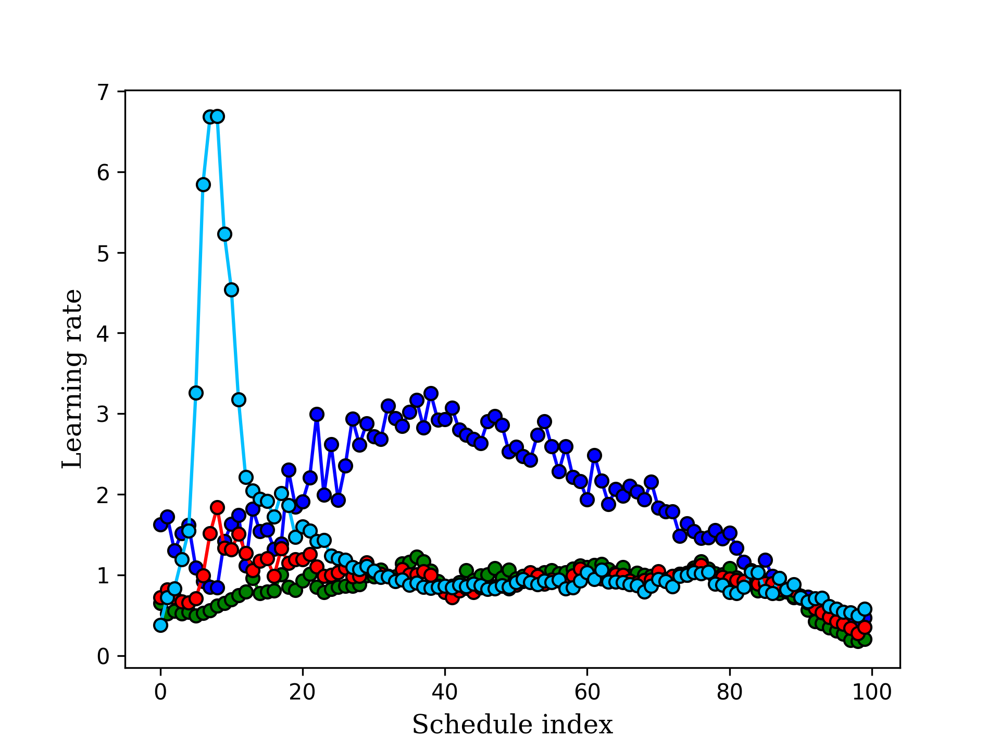

# Hyper Parameter Optimization: Hyper Gradient Descent Through Checkpointing

In this repository I reproduce some of the results presented in [Gradient-based Hyperparameter Optimization through Reversible Learning](https://arxiv.org/abs/1502.03492) but instead of performing the backpropagation of the training loop through exact representation, I used the checkpointing method proposed in [Revolve paper](https://dl.acm.org/doi/pdf/10.1145/347837.347846) to restore parameter values at a given iteration.

  
  
  

  